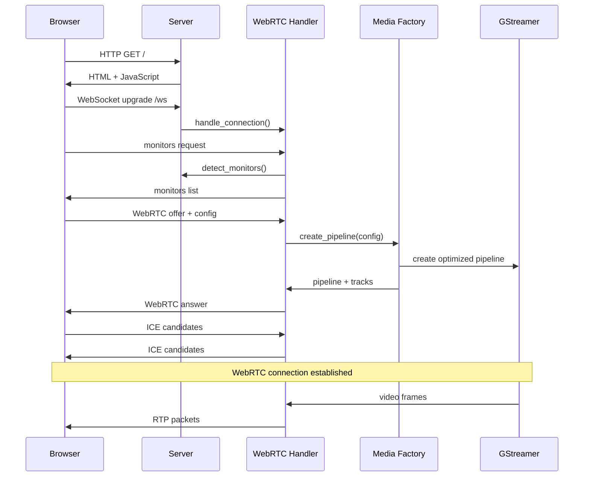

# 📚 Guia de Estudos Completo - Desktop Streamer Enhanced v2.0

Este guia explica **detalhadamente** a arquitetura modular avançada do Desktop Streamer v2.0 para desenvolvedores que querem entender, modificar e expandir o sistema. Aborda desde conceitos básicos até otimizações avançadas de performance.

## 📋 Índice

1. [Visão Geral da Arquitetura Modular](#1-visão-geral-da-arquitetura-modular)
2. [Módulo Principal (main.rs)](#2-módulo-principal-mainrs)
3. [Estado Compartilhado (config.rs)](#3-estado-compartilhado-configrs)
4. [Servidor Web (server.rs)](#4-servidor-web-serverrs)
5. [Gerenciador WebRTC (webrtc_handler.rs)](#5-gerenciador-webrtc-webrtc_handlerrs)
6. [Factory de Mídia (media.rs)](#6-factory-de-mídia-mediars)
7. [Fluxo de Dados Completo](#7-fluxo-de-dados-completo)
8. [Gerenciamento de Estado Concorrente](#8-gerenciamento-de-estado-concorrente)
9. [Sistema de Fallback e Detecção](#9-sistema-de-fallback-e-detecção)
10. [Modificações e Extensões](#10-modificações-e-extensões)

---

## 1. Visão Geral da Arquitetura Modular

### Por que Arquitetura Modular?

O código original era **monolítico** - tudo em um arquivo, uma função gigante. Problemas:

- ❌ Difícil de entender e manter
- ❌ Impossível de testar partes isoladamente  
- ❌ Não suporta múltiplos clientes
- ❌ Estado compartilhado confuso
- ❌ Difícil de debugar problemas específicos

A **nova arquitetura modular** resolve esses problemas:

```
desktop_streamer/
├── src/
│   ├── main.rs              # 🚀 Entry point e inicialização
│   ├── config.rs            # 📋 Estado compartilhado e tipos
│   ├── server.rs            # 🌐 Servidor web HTTP/WebSocket  
│   ├── webrtc_handler.rs    # 🔗 Gerenciamento de peers WebRTC
│   └── media.rs             # 🎥 Factory de pipelines GStreamer
├── static/                  # 🖼️ Interface web
└── Cargo.toml              # 📦 Dependências
```

### Princípios da Arquitetura

1. **Separação de Responsabilidades**: Cada módulo tem uma função específica
2. **Estado Centralizado**: `AppState` compartilhado thread-safe
3. **Factory Pattern**: `PipelineFactory` constrói pipelines dinamicamente
4. **Peer Isolation**: Cada cliente tem seu próprio `PeerState`
5. **Fallback Resiliente**: Sistema de fallback em cascata

---

## 2. Módulo Principal (main.rs)

### Responsabilidades

```rust
#[tokio::main]
async fn main() -> Result<()> {
    // 1. 📝 Configurar logging
    // 2. 🎬 Inicializar GStreamer  
    // 3. 🔍 Detectar capacidades do sistema
    // 4. 🏗️ Criar estado compartilhado
    // 5. 🚀 Iniciar servidor web
}
```

### Análise Linha por Linha

```rust
use std::{collections::HashMap, net::SocketAddr, sync::Arc, env};
use tokio::sync::Mutex;
use tracing::{info, level_filters::LevelFilter};
```

**O que significam essas importações?**

- `HashMap`: Para armazenar múltiplos peers (`PeerId -> PeerState`)
- `Arc`: **A**tomic **R**eference **C**ount - compartilha ownership entre threads
- `Mutex`: **Mut**ual **Ex**clusion - protege dados compartilhados
- `tracing`: Sistema de logs estruturados (melhor que `println!`)

### Inicialização do Logging

```rust
let env_filter = EnvFilter::builder()
    .with_default_directive(LevelFilter::INFO.into())
    .from_env_lossy();
tracing_subscriber::fmt().with_env_filter(env_filter).init();
```

**Por que usar `tracing` em vez de `println!`?**

- ✅ Níveis de log (ERROR, WARN, INFO, DEBUG, TRACE)
- ✅ Filtragem por módulo: `RUST_LOG=desktop_streamer=debug,webrtc=info`
- ✅ Timestamps automáticos
- ✅ Structured logging (JSON se necessário)
- ✅ Performance: logs podem ser desabilitados em runtime

### Detecção de Sistema

```rust
let session_type = env::var("XDG_SESSION_TYPE").unwrap_or_else(|_| "x11".to_string());
let has_portal = check_portal_availability().await;
let hw_info = detect_hardware_capabilities();
```

**O que cada detecção faz?**

1. **`XDG_SESSION_TYPE`**: 
   - `"x11"` = X Window System (tradicional)
   - `"wayland"` = Wayland (moderno, mais seguro)

2. **`check_portal_availability()`**:
   - Verifica se xdg-desktop-portal está rodando
   - Necessário para captura segura no Wayland

3. **`detect_hardware_capabilities()`**:
   - Detecta NVENC (NVIDIA)
   - Detecta VAAPI (Intel/AMD)  
   - Detecta V4L2 H.264 (hardware genérico)

### Criação do Estado Compartilhado

```rust
let app_state = Arc::new(AppState {
    peers: Mutex::new(HashMap::new()),
    hw_info: Arc::new(hw_info),
    session_type,
    has_portal,
});
```

**Padrão Arc + Mutex explicado:**

```
Thread 1 ←─┐
           ├→ Arc<AppState> ←─ Referência compartilhada
Thread 2 ←─┘
           
Dentro do AppState:
┌─────────────────────────────────┐
│ Mutex<HashMap<PeerId, PeerState>> │ ←─ Protege escrita simultânea
└─────────────────────────────────┘
```

---

## 3. Estado Compartilhado (config.rs)

### Estruturas de Dados Principais

#### AppState - Estado Global

```rust
pub struct AppState {
    pub peers: Mutex<HashMap<PeerId, Arc<PeerState>>>,  // Clientes conectados
    pub hw_info: Arc<HardwareInfo>,                     // Capacidades hardware
    pub session_type: String,                           // "x11" ou "wayland"
    pub has_portal: bool,                               // Portal disponível?
}
```

**Por que `Mutex<HashMap<PeerId, Arc<PeerState>>>`?**

- `Mutex`: Apenas uma thread pode modificar o HashMap por vez
- `PeerId`: UUID único para cada cliente (`Uuid::new_v4()`)
- `Arc<PeerState>`: Múltiplas referências ao mesmo peer (WebSocket + WebRTC)

#### PeerState - Estado por Cliente

```rust
pub struct PeerState {
    pub peer_connection: Arc<RTCPeerConnection>,        // Conexão WebRTC
    pub pipeline: gst::Pipeline,                        // Pipeline GStreamer
    pub ws_sender: Mutex<Option<SplitSink<WebSocket, Message>>>, // Canal WebSocket
}
```

**Lifecycle de um PeerState:**

1. **Criação**: Cliente conecta WebSocket
2. **WebRTC Setup**: Offer/Answer/ICE exchange
3. **Pipeline**: GStreamer pipeline criado
4. **Streaming**: Dados fluem GStreamer → WebRTC → Browser
5. **Cleanup**: Cliente desconecta, recursos liberados

#### PipelineConfig - Configuração de Pipeline

```rust
#[derive(Debug, Serialize, Deserialize, Clone)]
pub struct PipelineConfig {
    pub source_type: String,         // "x11-0", "wayland-portal", "camera-0"
    pub audio_source: Option<String>, // "microphone", "system", None
    pub resolution: (u32, u32),      // (1920, 1080)
    pub framerate: u32,              // 30
    pub use_hardware_encoding: bool, // true para NVENC/VAAPI
}
```

### Sistema de Mensagens WebSocket

```rust
#[derive(Debug, Serialize, Deserialize)]
#[serde(tag = "type", rename_all = "kebab-case")]
pub enum SignalMessage {
    Offer { sdp: String, config: PipelineConfig },
    Answer { sdp: String },
    IceCandidate { candidate: String },
    Error { message: String },
    Monitors { monitors: Vec<MonitorInfo> },
    PortalRequest { request_id: String },
    PortalResponse { request_id: String, node_id: Option<u32> },
}
```

**Atributo `#[serde(tag = "type")]` explicado:**

```json
// Sem tag
{"Offer": {"sdp": "...", "config": {...}}}

// Com tag (mais limpo)
{"type": "offer", "sdp": "...", "config": {...}}
```

---

## 4. Servidor Web (server.rs)

### Responsabilidades

1. **Servir arquivos estáticos** (HTML, CSS, JS)
2. **Gerenciar WebSocket upgrades**
3. **Detectar monitores disponíveis**
4. **CORS e middleware**

### Função run_server()

```rust
pub async fn run_server(app_state: Arc<AppState>, addr: SocketAddr) -> Result<()> {
    let cors = CorsLayer::new().allow_origin(Any).allow_methods(Any).allow_headers(Any);

    let app = Router::new()
        .route("/", get(serve_index))                    // GET / → HTML
        .route("/ws", get(websocket_handler))            // WebSocket upgrade
        .fallback_service(ServeDir::new("static"))       // Arquivos estáticos
        .with_state(app_state)                           // Injeta AppState
        .layer(cors);                                    // Habilita CORS

    axum_server::bind(addr).serve(app.into_make_service()).await?;
    Ok(())
}
```

**Padrão Router explicado:**

```
HTTP Request → Router → Handler Function
     ↓
GET /        → serve_index()       → HTML
GET /ws      → websocket_handler() → WebSocket upgrade  
GET /app.js  → ServeDir           → static/app.js
```

### WebSocket Handler

```rust
async fn websocket_handler(
    ws: WebSocketUpgrade,
    State(state): State<Arc<AppState>>,
) -> impl IntoResponse {
    let peer_id = Uuid::new_v4();  // UUID único para este cliente
    info!("New WebSocket connection: {}", peer_id);
    
    ws.on_upgrade(move |socket| {
        webrtc_handler::handle_connection(socket, peer_id, state)
    })
}
```

**Fluxo de upgrade:**

```
Browser                    Server
   │                         │
   ├── GET /ws HTTP/1.1 ──→  │ websocket_handler()
   │   Upgrade: websocket    │
   │                         │
   │ ←── 101 Switching ───── │
   │     Protocols           │
   │                         │
   ├═══ WebSocket Canal ════│ handle_connection()
```

### Detecção de Monitores

```rust
pub async fn detect_monitors(session_type: &str, has_portal: bool) -> Vec<MonitorInfo> {
    let mut monitors = Vec::new();
    
    if session_type == "wayland" && has_portal {
        // Adiciona opção portal
        monitors.push(MonitorInfo {
            id: "wayland-portal".to_string(),
            name: "Tela (via Portal)".to_string(),
            primary: true,
            resolution: "Dinâmica".to_string(),
            source_type: "screen".to_string(),
        });
    } else if session_type == "x11" {
        // Usa xrandr para listar monitores
        if let Ok(output) = Command::new("xrandr").arg("--query").output() {
            // Parse da saída do xrandr...
        }
    }
    
    // Detecta câmeras USB
    detect_cameras(&mut monitors).await;
    
    monitors
}
```

---

## 5. Gerenciador WebRTC (webrtc_handler.rs)

### Responsabilidades

1. **Gerenciar lifecycle de peer connections**
2. **Sinalização WebRTC** (SDP Offer/Answer, ICE candidates)
3. **Integração com media pipeline**
4. **Cleanup de recursos**

### Função Principal handle_connection()

```rust
pub async fn handle_connection(
    socket: WebSocket,
    peer_id: PeerId,
    app_state: Arc<AppState>,
) {
    let (ws_sender, ws_receiver) = socket.split();
    
    // Canal para comunicação WebRTC → WebSocket
    let (tx_to_ws, mut rx_from_webrtc) = mpsc::unbounded_channel::<SignalMessage>();
    
    // Loop principal de mensagens WebSocket
    let handle_messages = async move {
        // Processa mensagens do browser
    };
    
    // Forward mensagens WebRTC para WebSocket
    let forward_webrtc = async move {
        // Envia mensagens para o browser
    };
    
    // Executa ambos concorrentemente
    tokio::select! {
        _ = handle_messages => {},
        _ = forward_webrtc => {},
    }
}
```

**Padrão de comunicação:**

```
Browser ←─── WebSocket ───→ Server
   ↑                          ↓
   │                          │
   │      WebRTC Data         │
   └──────────────────────────┘
```

### Processamento de Offer WebRTC

```rust
SignalMessage::Offer { sdp, config } => {
    info!("Processing WebRTC offer for peer {}", peer_id);
    
    // 1. Criar peer connection
    let pc = create_peer_connection(&tx_to_ws).await?;
    
    // 2. Criar pipeline baseado na config
    let mut factory = PipelineFactory::new();
    let (pipeline, tracks) = factory.create_pipeline(
        &config,
        &app_state.hw_info,
        None, // pipewire_node_id
        &app_state.session_type,
        app_state.has_portal,
    ).await?;
    
    // 3. Adicionar tracks ao peer connection
    for track in tracks {
        pc.add_track(track).await?;
    }
    
    // 4. Processar SDP offer
    let offer = RTCSessionDescription::offer(sdp)?;
    pc.set_remote_description(offer).await?;
    
    // 5. Criar answer
    let answer = pc.create_answer(None).await?;
    pc.set_local_description(answer.clone()).await?;
    
    // 6. Enviar answer para browser
    let _ = tx_to_ws.send(SignalMessage::Answer { 
        sdp: answer.sdp 
    });
}
```

### ICE Candidate Exchange

```rust
// Receber candidato do browser
SignalMessage::IceCandidate { candidate } => {
    if let Ok(ice_candidate) = serde_json::from_str::<RTCIceCandidateInit>(&candidate) {
        if let Ok(candidate) = RTCIceCandidate::from(ice_candidate) {
            let _ = peer_connection.add_ice_candidate(candidate).await;
        }
    }
}

// Enviar candidatos encontrados para o browser  
pc.on_ice_candidate(Box::new(move |c: Option<RTCIceCandidate>| {
    Box::pin(async move {
        if let Some(candidate) = c {
            if let Ok(init) = candidate.to_json() {
                if let Ok(candidate_json) = serde_json::to_string(&init) {
                    let _ = tx.send(SignalMessage::IceCandidate { 
                        candidate: candidate_json 
                    });
                }
            }
        }
    })
}));
```

---

## 6. Factory de Mídia (media.rs)

### Responsabilidades

1. **Detectar capacidades de hardware**
2. **Construir pipelines otimizados dinamicamente**
3. **Sistema de fallback em cascata**
4. **Integração com WebRTC tracks**

### Detecção de Hardware

```rust
pub fn detect_hardware_capabilities() -> HardwareInfo {
    info!("Detecting hardware acceleration capabilities...");
    
    // Verificar se plugins existem no GStreamer
    let has_nvenc = gst::ElementFactory::find("nvh264enc").is_some();
    let has_vaapi = gst::ElementFactory::find("vaapivp8enc").is_some() 
        || gst::ElementFactory::find("vaapih264enc").is_some();
    let has_v4l2h264enc = gst::ElementFactory::find("v4l2h264enc").is_some();
    
    // Verificar dispositivos físicos
    let has_intel_gpu = std::path::Path::new("/dev/dri/renderD128").exists();
    
    HardwareInfo {
        has_nvenc,
        has_vaapi,
        has_v4l2h264enc,
        has_intel_gpu,
    }
}
```

**Como funciona `ElementFactory::find()`?**

```rust
// GStreamer mantém um registry de todos plugins disponíveis
// find() verifica se o plugin foi carregado e está funcional

if gst::ElementFactory::find("nvh264enc").is_some() {
    println!("✅ NVIDIA NVENC disponível");
} else {
    println!("❌ NVIDIA NVENC não encontrado");
}
```

### Pipeline Factory com Fallback

```rust
impl PipelineFactory {
    pub async fn create_pipeline(
        &mut self,
        config: &PipelineConfig,
        hw_info: &HardwareInfo,
        // ... outros parâmetros
    ) -> Result<(gst::Pipeline, Vec<Arc<TrackLocalStaticRTP>>)> {
        
        // Obter lista de configurações por prioridade
        let pipeline_configurations = self.get_pipeline_configurations(
            config, hw_info, pipewire_node_id, session_type, has_portal
        );
        
        // Tentar cada configuração até uma funcionar
        for (desc, pipeline_str) in pipeline_configurations {
            info!("Attempting to create pipeline: {}", desc);
            
            match self.try_create_pipeline(&pipeline_str, video_sender.clone()) {
                Ok(pipeline) => {
                    info!("✅ Successfully created pipeline: {}", desc);
                    return Ok((pipeline, tracks));
                }
                Err(e) => {
                    warn!("❌ Failed to create pipeline '{}': {}. Trying fallback...", desc, e);
                    continue;
                }
            }
        }
        
        Err(anyhow!("All pipeline configurations failed"))
    }
}
```

### Configurações de Pipeline por Prioridade

```rust
fn get_pipeline_configurations(&self, config: &PipelineConfig, hw_info: &HardwareInfo) 
    -> Vec<(String, String)> {
    
    let mut configs = Vec::new();
    
    // 1ª Prioridade: Hardware + H.264 (melhor performance)
    if config.use_hardware_encoding && hw_info.has_nvenc {
        configs.push((
            "NVIDIA NVENC H.264".to_string(),
            format!(
                "ximagesrc ! videoconvert ! nvvidconv ! 'video/x-raw(memory:NVMM)' ! \
                 nvh264enc preset=low-latency-hq rc-mode=cbr gop-size=60 ! \
                 h264parse ! rtph264pay ! appsink name=videosink"
            )
        ));
    }
    
    // 2ª Prioridade: VAAPI VP8
    if config.use_hardware_encoding && hw_info.has_vaapi {
        configs.push((
            "VAAPI VP8".to_string(),
            format!(
                "ximagesrc ! videoconvert ! vaapipostproc ! 'video/x-raw(memory:VASurface)' ! \
                 vaapivp8enc rate-control=cbr quality-level=5 ! \
                 rtpvp8pay ! appsink name=videosink"
            )
        ));
    }
    
    // 3ª Prioridade: Software VP8 (fallback universal)
    configs.push((
        "Software VP8".to_string(),
        format!(
            "ximagesrc ! videoconvert ! \
             vp8enc deadline=1 cpu-used=8 threads={} error-resilient=1 \
             keyframe-max-dist=60 target-bitrate=5000000 ! \
             rtpvp8pay ! appsink name=videosink",
            *NUM_CPUS
        )
    ));
    
    configs
}
```

### Integração com WebRTC

```rust
fn try_create_pipeline(
    &self,
    pipeline_str: &str,
    video_sender: mpsc::UnboundedSender<Bytes>,
) -> Result<gst::Pipeline> {
    
    // 1. Criar pipeline do string
    let pipeline = gst::parse::launch(pipeline_str)?;
    
    // 2. Encontrar o appsink
    let appsink = pipeline
        .by_name("videosink")
        .ok_or_else(|| anyhow!("Failed to get videosink"))?
        .downcast::<AppSink>()
        .map_err(|_| anyhow!("Failed to downcast to AppSink"))?;
    
    // 3. Configurar callback para receber dados
    appsink.set_callbacks(
        gstreamer_app::AppSinkCallbacks::builder()
            .new_sample(move |sink| {
                // Extrair buffer do sample
                let sample = sink.pull_sample().map_err(|_| gst::FlowError::Eos)?;
                let buffer = sample.buffer().ok_or(gst::FlowError::Error)?;
                let map = buffer.map_readable().map_err(|_| gst::FlowError::Error)?;
                
                // Enviar para WebRTC
                let _ = tx_from_gst.send(Bytes::copy_from_slice(&map));
                
                Ok(gst::FlowSuccess::Ok)
            })
            .build(),
    );
    
    // 4. Iniciar pipeline
    pipeline.set_state(gst::State::Playing)?;
    
    Ok(pipeline)
}
```

---

## 7. Fluxo de Dados Completo

### Sequência de Inicialização



### Fluxo de Dados de Vídeo

```
┌─────────────┐    ┌─────────────┐    ┌─────────────┐    ┌─────────────┐
│   Screen    │    │ GStreamer   │    │   WebRTC    │    │   Browser   │
│  Capture    │    │  Pipeline   │    │    Track    │    │   Video     │
│             │    │             │    │             │    │  Element    │
└─────────────┘    └─────────────┘    └─────────────┘    └─────────────┘
        │                  │                  │                  │
        │ Raw frames       │ Compressed       │ RTP packets      │ Display
        │ (RGB/YUV)        │ (VP8/H.264)      │ (over WebRTC)    │ frames
        ├─────────────────→│─────────────────→│─────────────────→│
        │                  │                  │                  │
        │ ximagesrc/       │ vp8enc/nvh264enc │ TrackLocal       │ <video>
        │ pipewiresrc      │ + rtpvp8pay      │ .write()         │ element
```

### Estado Concorrente

```rust
// Estado global compartilhado entre todas as threads
Arc<AppState> {
    peers: Mutex<HashMap<PeerId, Arc<PeerState>>> {
        "550e8400-e29b-41d4-a716-446655440000": Arc<PeerState> {
            peer_connection: Arc<RTCPeerConnection>,
            pipeline: gst::Pipeline,
            ws_sender: Mutex<WebSocket>,
        },
        "6ba7b810-9dad-11d1-80b4-00c04fd430c8": Arc<PeerState> {
            // Outro cliente...
        }
    },
    hw_info: Arc<HardwareInfo> { /* Capacidades detectadas */ },
    session_type: "wayland",
    has_portal: true,
}
```

---

## 8. Gerenciamento de Estado Concorrente

### Por que Concorrência é Complexa?

Em aplicações web, múltiplas coisas acontecem simultaneamente:

- 🌐 **Múltiplos clientes** conectando/desconectando
- 📡 **WebSocket messages** chegando assincronamente  
- 🎥 **GStreamer** produzindo frames continuamente
- 🔗 **WebRTC** enviando/recebendo dados de rede

### Padrão Arc + Mutex

```rust
// Compartilhamento seguro de dados
let shared_data = Arc::new(Mutex::new(HashMap::new()));

// Thread 1
let data_clone = shared_data.clone();
tokio::spawn(async move {
    let mut lock = data_clone.lock().await;
    lock.insert("key", "value");
});

// Thread 2  
let data_clone = shared_data.clone();
tokio::spawn(async move {
    let lock = data_clone.lock().await;
    if let Some(value) = lock.get("key") {
        println!("Found: {}", value);
    }
});
```

### Canais para Comunicação Entre Tasks

```rust
// Canal para enviar mensagens de WebRTC para WebSocket
let (tx_to_ws, mut rx_from_webrtc) = mpsc::unbounded_channel::<SignalMessage>();

// Task 1: WebRTC produzindo candidatos ICE
let tx_clone = tx_to_ws.clone();
tokio::spawn(async move {
    // Quando encontrar candidato ICE...
    tx_clone.send(SignalMessage::IceCandidate { 
        candidate: candidate_json 
    }).unwrap();
});

// Task 2: WebSocket consumindo mensagens
tokio::spawn(async move {
    while let Some(message) = rx_from_webrtc.recv().await {
        // Enviar para browser via WebSocket
        ws_sender.send(Message::Text(serde_json::to_string(&message)?)).await?;
    }
});
```

### Cleanup de Recursos

```rust
impl Drop for PeerState {
    fn drop(&mut self) {
        info!("Cleaning up resources for peer");
        
        // Parar pipeline GStreamer
        let _ = self.pipeline.set_state(gst::State::Null);
        
        // Fechar peer connection
        let pc = self.peer_connection.clone();
        tokio::spawn(async move {
            let _ = pc.close().await;
        });
    }
}

// Remoção segura do estado compartilhado
async fn remove_peer(app_state: &Arc<AppState>, peer_id: PeerId) {
    let mut peers = app_state.peers.lock().await;
    if let Some(peer_state) = peers.remove(&peer_id) {
        info!("Removed peer {} from active connections", peer_id);
        // PeerState::drop() será chamado automaticamente
    }
}
```

---

## 9. Sistema de Fallback e Detecção

### Por que Fallback é Crítico?

Sistemas diferentes têm capacidades diferentes:

- 🖥️ **Desktop**: NVIDIA RTX 3080 → NVENC H.264 (melhor)
- 💻 **Laptop**: Intel iGPU → VAAPI VP8 (bom)  
- 🐧 **Servidor**: CPU only → Software VP8 (funciona)
- 🔧 **CI/CD**: Sem GPU → Test pattern (testes)

### Estratégia de Detecção

```rust
// 1. Detectar ambiente de display
let session_type = std::env::var("XDG_SESSION_TYPE")
    .unwrap_or_else(|_| "x11".to_string());

// 2. Verificar portal para Wayland
let has_portal = Command::new("busctl")
    .args(&["--user", "list"])
    .output()
    .map(|output| String::from_utf8_lossy(&output.stdout)
        .contains("org.freedesktop.portal.Desktop"))
    .unwrap_or(false);

// 3. Provar plugins GStreamer
let has_nvenc = gst::ElementFactory::find("nvh264enc").is_some();
let has_vaapi = gst::ElementFactory::find("vaapivp8enc").is_some();

// 4. Verificar devices de hardware
let has_nvidia_gpu = std::path::Path::new("/dev/nvidia0").exists();
let has_intel_gpu = std::path::Path::new("/dev/dri/renderD128").exists();
```

### Cascata de Fallback

```rust
fn select_optimal_pipeline(config: &PipelineConfig, hw_info: &HardwareInfo) -> PipelineSpec {
    // Prioridade 1: NVIDIA NVENC (melhor performance)
    if config.use_hardware_encoding && hw_info.has_nvenc {
        return PipelineSpec {
            encoder: "nvh264enc",
            codec: "H.264",
            bitrate: 15_000_000,  // 15 Mbps
            preset: "low-latency-hq",
        };
    }
    
    // Prioridade 2: Intel/AMD VAAPI  
    if config.use_hardware_encoding && hw_info.has_vaapi {
        return PipelineSpec {
            encoder: "vaapivp8enc", 
            codec: "VP8",
            bitrate: 10_000_000,  // 10 Mbps
            preset: "rate-control=cbr",
        };
    }
    
    // Prioridade 3: Software VP8 (universal)
    PipelineSpec {
        encoder: "vp8enc",
        codec: "VP8", 
        bitrate: 5_000_000,   // 5 Mbps
        preset: "deadline=1 cpu-used=8",
    }
}
```

### Fallback de Fonte de Vídeo

```rust
fn get_video_source_pipeline(session_type: &str, has_portal: bool, source_id: &str) -> String {
    match (session_type, has_portal, source_id) {
        // Wayland com portal (preferido)
        ("wayland", true, "wayland-portal") => {
            "pipewiresrc fd={} path={} ! videoconvert".to_string()
        }
        
        // X11 com monitor específico
        ("x11", _, id) if id.starts_with("x11-") => {
            let screen_num = id.strip_prefix("x11-").unwrap_or("0");
            format!("ximagesrc display-name=:0 screen-num={} use-damage=false ! videoconvert", screen_num)
        }
        
        // Câmera USB
        (_, _, id) if id.starts_with("camera-") => {
            let device_num = id.strip_prefix("camera-").unwrap_or("0");
            format!("v4l2src device=/dev/video{} ! videoconvert", device_num)
        }
        
        // Fallback: test pattern
        _ => {
            "videotestsrc pattern=smpte ! video/x-raw,width=1920,height=1080,framerate=30/1 ! videoconvert".to_string()
        }
    }
}
```

---

## 10. Modificações e Extensões

### Como Adicionar Nova Fonte de Vídeo

**Exemplo: Captura de janela específica no X11**

1. **Modificar `detect_monitors()` em `server.rs`:**

```rust
// Detectar janelas abertas com xwininfo
if session_type == "x11" {
    let window_output = Command::new("xwininfo").args(&["-tree", "-root"]).output()?;
    let windows = parse_xwininfo_output(&window_output.stdout);
    
    for window in windows {
        monitors.push(MonitorInfo {
            id: format!("window-{}", window.id),
            name: format!("Janela: {}", window.title),
            primary: false,
            resolution: format!("{}x{}", window.width, window.height),
            source_type: "window".to_string(),
        });
    }
}
```

2. **Adicionar pipeline em `media.rs`:**

```rust
// Em get_pipeline_configurations()
if source_type.starts_with("window-") {
    let window_id = source_type.strip_prefix("window-").unwrap();
    pipeline_configs.push((
        format!("X11 Window {}", window_id),
        format!(
            "ximagesrc xid={} use-damage=false ! videoconvert ! {}",
            window_id, encoder_chain
        )
    ));
}
```

### Como Adicionar Áudio

**1. Modificar `PipelineConfig`:**

```rust
#[derive(Debug, Serialize, Deserialize, Clone)]
pub struct PipelineConfig {
    // ... campos existentes
    pub enable_audio: bool,
    pub audio_source: Option<String>, // "microphone", "system", "application"
    pub audio_bitrate: u32,           // 96000, 128000, 256000
}
```

**2. Criar pipeline de áudio:**

```rust
fn create_audio_pipeline(config: &PipelineConfig) -> String {
    match config.audio_source.as_deref() {
        Some("microphone") => {
            format!(
                "pulsesrc device-name=@DEFAULT_SOURCE@ ! \
                 audioconvert ! audioresample ! \
                 opusenc bitrate={} ! rtpopuspay ! \
                 appsink name=audiosink sync=false",
                config.audio_bitrate
            )
        }
        Some("system") => {
            format!(
                "pulsesrc device-name=@DEFAULT_MONITOR@ ! \
                 audioconvert ! audioresample ! \
                 opusenc bitrate={} ! rtpopuspay ! \
                 appsink name=audiosink sync=false", 
                config.audio_bitrate
            )
        }
        _ => String::new()
    }
}
```

**3. Pipeline unificado (áudio + vídeo):**

```rust
fn create_unified_pipeline(config: &PipelineConfig) -> String {
    let video_pipeline = create_video_pipeline(config);
    
    if config.enable_audio {
        let audio_pipeline = create_audio_pipeline(config);
        format!("{} {} ", video_pipeline, audio_pipeline)
    } else {
        video_pipeline
    }
}
```

### Como Adicionar Novas Métricas

**1. Estrutura de métricas:**

```rust
#[derive(Debug, Serialize)]
pub struct PerformanceMetrics {
    pub fps: f32,
    pub bitrate_bps: u64,
    pub cpu_usage_percent: f32,
    pub memory_usage_mb: u64,
    pub dropped_frames: u32,
    pub encoder_type: String,
}
```

**2. Coleta de métricas:**

```rust
impl PeerState {
    pub fn collect_metrics(&self) -> PerformanceMetrics {
        // Usar GStreamer queries para obter estatísticas
        let query = gst::query::Latency::new();
        let _ = self.pipeline.query(&mut query);
        
        PerformanceMetrics {
            fps: self.get_current_fps(),
            bitrate_bps: self.get_current_bitrate(),
            cpu_usage_percent: self.get_cpu_usage(),
            memory_usage_mb: self.get_memory_usage(),
            dropped_frames: self.get_dropped_frames(),
            encoder_type: self.get_encoder_name(),
        }
    }
}
```

**3. Envio periódico:**

```rust
// Enviar métricas a cada 5 segundos
let metrics_interval = tokio::time::interval(Duration::from_secs(5));
tokio::spawn(async move {
    loop {
        metrics_interval.tick().await;
        
        if let Some(peer_state) = get_peer_state(peer_id).await {
            let metrics = peer_state.collect_metrics();
            let _ = tx_to_ws.send(SignalMessage::Metrics { metrics });
        }
    }
});
```

### Debugging Avançado

**1. Logs estruturados:**

```rust
use tracing::{info, debug, warn, error, instrument};

#[instrument(skip(self), fields(peer_id = %peer_id))]
async fn create_peer_connection(&self, peer_id: PeerId) -> Result<RTCPeerConnection> {
    debug!("Creating peer connection");
    
    let config = RTCConfiguration {
        ice_servers: vec![RTCIceServer {
            urls: vec!["stun:stun.l.google.com:19302".to_owned()],
            ..Default::default()
        }],
        ..Default::default()
    };
    
    match api.new_peer_connection(config).await {
        Ok(pc) => {
            info!("Peer connection created successfully");
            Ok(pc)
        }
        Err(e) => {
            error!("Failed to create peer connection: {}", e);
            Err(anyhow!(e))
        }
    }
}
```

**2. Métricas de sistema:**

```rust
// Usando tokio-metrics para performance
let metrics = tokio_metrics::TaskMonitor::new();
let _guard = metrics.instrument(async {
    // Código que queremos medir
    handle_websocket_connection().await
});

// Collectar estatísticas
let task_stats = metrics.collect();
info!("Task executed {} times, mean duration: {:?}", 
      task_stats.total_count, task_stats.mean_duration);
```

Este guia fornece uma base sólida para entender, modificar e expandir o Desktop Streamer Enhanced v2.0. A arquitetura modular permite que cada componente seja desenvolvido e testado independentemente, facilitando a manutenção e evolução do sistema.

**O que é `tracing`?**
- Sistema de logs para debugar a aplicação
- Mostra mensagens como "Conectou usuário", "Erro na câmera", etc.

```rust
// Initialize GStreamer
gst::init()?;
info!("GStreamer initialized successfully");
```

**Por que inicializar GStreamer?**
- GStreamer precisa ser "ligado" antes de usar
- O `?` significa: "se der erro, pare a função e retorne o erro"

```rust
// Detect system capabilities
let session_type = env::var("XDG_SESSION_TYPE").unwrap_or_else(|_| "x11".to_string());
let has_portal = check_portal_availability().await;
```

**O que está acontecendo aqui?**
- `XDG_SESSION_TYPE`: Variável que diz se você usa X11 ou Wayland (tipos de interface gráfica no Linux)
- `check_portal_availability()`: Verifica se o sistema suporta captura segura no Wayland
- `unwrap_or_else()`: Se não conseguir ler a variável, usa "x11" como padrão

```rust
let app = Router::new()
    .route("/", get(serve_index))
    .route("/ws", get(websocket_handler))
    .layer(CorsLayer::permissive())
    .with_state(state)
    .fallback_service(tower_http::services::ServeDir::new("static"));
```

**Entendendo o Router:**
- `route("/", get(serve_index))`: Quando alguém acessa http://localhost:3000/, chama a função `serve_index`
- `route("/ws", get(websocket_handler))`: Para conexões WebSocket
- `CorsLayer::permissive()`: Permite requisições de outros domínios
- `fallback_service`: Serve arquivos estáticos (HTML, CSS, JS)

---

## 3. Estruturas de Dados

### 3.1 SignalMessage - Mensagens entre Browser e Servidor

```rust
#[derive(Debug, Serialize, Deserialize)]
#[serde(tag = "type")]
enum SignalMessage {
    #[serde(rename = "offer")]
    Offer { sdp: String, source_type: Option<String> },
    // ... outras mensagens
}
```

**O que é isso?**
- `enum`: Um tipo que pode ser uma de várias opções
- `Serialize/Deserialize`: Converte para/de JSON automaticamente
- `#[serde(tag = "type")]`: O JSON terá um campo "type" que indica qual tipo de mensagem é

**Exemplo de JSON gerado:**
```json
{
  "type": "offer",
  "sdp": "v=0\r\no=- 123...",
  "sourceType": "wayland-portal"
}
```

**Tipos de mensagem:**
- **Offer**: Browser oferece uma conexão WebRTC
- **Answer**: Servidor responde à oferta
- **Candidate**: Informações de rede para conectar
- **Monitors**: Lista de telas/câmeras disponíveis
- **Error**: Quando algo dá errado

### 3.2 MonitorInfo - Informações de Telas/Câmeras

```rust
#[derive(Debug, Serialize, Deserialize, Clone)]
struct MonitorInfo {
    id: String,           // Identificador único
    name: String,         // Nome amigável
    primary: bool,        // É a tela principal?
    resolution: String,   // Resolução (ex: "1920x1080")
    source_type: String,  // "screen" ou "camera"
}
```

**Exemplo:**
```json
{
  "id": "x11-0",
  "name": "HDMI-1 (X11)",
  "primary": true,
  "resolution": "1920x1080",
  "type": "screen"
}
```

### 3.3 AppState - Estado Compartilhado

```rust
#[derive(Clone)]
pub struct AppState {
    session_type: String,  // "x11" ou "wayland"
    has_portal: bool,      // Suporta portal do desktop?
}
```

**Por que usar State?**
- Compartilha informações entre diferentes conexões WebSocket
- Evita detectar o sistema várias vezes

---

## 4. Fluxo de Execução

### 4.1 Quando o Servidor Inicia

```
main()
  ├── Inicializa GStreamer
  ├── Detecta tipo de sistema (X11/Wayland)
  ├── Cria router web
  └── Inicia servidor na porta 3000
```

### 4.2 Quando um Browser Conecta

```
Browser acessa http://localhost:3000
  ├── serve_index() → Envia index.html
  ├── Browser carrega JavaScript
  ├── JavaScript conecta WebSocket em /ws
  ├── websocket_handler() é chamado
  └── handle_websocket() gerencia a conexão
```

### 4.3 Processo de Streaming

```
1. Browser conecta WebSocket
2. Servidor detecta monitores/câmeras
3. Servidor envia lista para browser
4. Usuário escolhe uma fonte
5. Browser cria oferta WebRTC
6. Servidor cria pipeline GStreamer
7. Servidor responde com answer WebRTC
8. Conexão estabelecida
9. Vídeo flui: GStreamer → WebRTC → Browser
```

---

## 5. Comunicação WebSocket

### 5.1 Por que WebSocket?

HTTP normal funciona assim:
```
Browser → Pergunta → Servidor
Browser ← Resposta ← Servidor
[Conexão fecha]
```

WebSocket funciona assim:
```
Browser ↔ Canal sempre aberto ↔ Servidor
```

**Vantagens:**
- Comunicação em tempo real
- Servidor pode enviar dados quando quiser
- Menos overhead que HTTP

### 5.2 Função handle_websocket

```rust
async fn handle_websocket(socket: WebSocket, state: Arc<AppState>) {
    let (mut ws_sender, mut ws_receiver) = socket.split();
```

**O que acontece:**
- `socket.split()`: Separa o WebSocket em duas partes:
  - `ws_sender`: Para enviar mensagens ao browser
  - `ws_receiver`: Para receber mensagens do browser

```rust
let (tx_to_ws, mut rx_from_pc) = mpsc::unbounded_channel::<SignalMessage>();
```

**O que é `mpsc::unbounded_channel`?**
- `mpsc`: Multiple Producer, Single Consumer
- É como um tubo onde várias partes podem colocar mensagens, mas só uma consome
- `tx_to_ws`: Para enviar mensagens para o WebSocket
- `rx_from_pc`: Para receber mensagens de WebRTC

**Por que usar channels?**
- Diferentes partes do código (WebRTC, GStreamer) precisam enviar mensagens
- Channels permitem comunicação segura entre threads

### 5.3 Loop Principal do WebSocket

```rust
while let Some(Ok(msg)) = ws_receiver.next().await {
    if let Message::Text(text) = msg {
        let signal: SignalMessage = match serde_json::from_str(&text) {
            Ok(s) => s,
            Err(e) => {
                // Trata erro
            }
        };
        
        match signal {
            SignalMessage::Offer { sdp, source_type } => {
                // Processa oferta WebRTC
            }
            SignalMessage::Candidate { candidate } => {
                // Processa candidato ICE
            }
            // ... outros casos
        }
    }
}
```

**Como funciona:**
1. `ws_receiver.next().await`: Espera por uma mensagem do browser
2. `serde_json::from_str()`: Converte JSON para `SignalMessage`
3. `match signal`: Decide o que fazer baseado no tipo de mensagem

---

## 6. Pipeline GStreamer

### 6.1 O que é um Pipeline?

Imagine uma linha de produção de fábrica:
```
[Matéria Prima] → [Máquina 1] → [Máquina 2] → [Produto Final]
```

No GStreamer:
```
[Captura Tela] → [Converte Formato] → [Comprime VP8] → [Empacota RTP] → [Saída]
```

### 6.2 Exemplo de Pipeline para X11

```rust
let pipeline_str = format!(
    "ximagesrc display-name=:0 screen-num={} show-pointer=true use-damage=false ! \
     video/x-raw,framerate=30/1 ! \
     videoscale ! \
     video/x-raw,format=I420 ! \
     videoconvert ! \
     queue max-size-buffers=2 leaky=downstream ! \
     vp8enc deadline=16 cpu-used=4 threads=4 error-resilient=1 \
     keyframe-max-dist=30 target-bitrate=10000000 end-usage=1 \
     min-quantizer=4 max-quantizer=56 ! \
     rtpvp8pay pt=96 mtu=1200 ! \
     appsink name=sink sync=false drop=true max-buffers=2",
    screen_num
);
```

**Decompondo cada parte:**

1. **`ximagesrc`**: Captura tela no X11
   - `display-name=:0`: Display padrão
   - `screen-num={}`: Número da tela
   - `show-pointer=true`: Mostra cursor do mouse

2. **`video/x-raw,framerate=30/1`**: Define formato
   - `framerate=30/1`: 30 frames por segundo

3. **`videoscale`**: Redimensiona vídeo se necessário

4. **`video/x-raw,format=I420`**: Formato de cor específico
   - I420 é eficiente para compressão

5. **`videoconvert`**: Converte entre formatos

6. **`queue`**: Buffer temporário
   - `max-size-buffers=2`: Máximo 2 frames no buffer
   - `leaky=downstream`: Descarta frames antigos se buffer encher

7. **`vp8enc`**: Compressor VP8
   - `deadline=16`: Tempo máximo para comprimir um frame
   - `cpu-used=4`: Balanceio velocidade vs qualidade
   - `target-bitrate=10000000`: 10 Mbps de bitrate

8. **`rtpvp8pay`**: Empacota para transmissão RTP
   - `pt=96`: Payload type
   - `mtu=1200`: Tamanho máximo de pacote

9. **`appsink`**: Saída para aplicação
   - `sync=false`: Não sincroniza com clock
   - `drop=true`: Descarta frames se não conseguir processar

### 6.3 Diferenças entre Fontes

**X11 (ximagesrc):**
- Acesso direto ao buffer da tela
- Mais simples, menos seguro
- Funciona em X11 tradicional

**Wayland (pipewiresrc):**
- Usa xdg-desktop-portal para segurança
- Usuário precisa autorizar captura
- Mais complexo, mais seguro

**Câmera (v4l2src):**
- Acessa device `/dev/video0`, `/dev/video1`, etc.
- Resolução/formato fixos
- Menor qualidade que tela

### 6.4 Configuração do AppSink

```rust
let appsink = pipeline
    .by_name("sink")
    .ok_or_else(|| anyhow!("Failed to get appsink"))?
    .downcast::<AppSink>()
    .map_err(|_| anyhow!("Failed to downcast to AppSink"))?;

appsink.set_callbacks(
    gstreamer_app::AppSinkCallbacks::builder()
        .new_sample(move |sink| {
            let sample = sink.pull_sample().map_err(|_| gst::FlowError::Eos)?;
            let buffer = sample.buffer().ok_or(gst::FlowError::Error)?;
            let map = buffer.map_readable().map_err(|_| gst::FlowError::Error)?;
            
            let _ = tx_from_gst.send(Bytes::copy_from_slice(&map));
            
            Ok(gst::FlowSuccess::Ok)
        })
        .build(),
);
```

**O que acontece:**
1. `by_name("sink")`: Encontra o elemento `appsink` no pipeline
2. `set_callbacks()`: Define função para chamar quando novo frame chega
3. `pull_sample()`: Pega o frame do GStreamer
4. `buffer.map_readable()`: Acessa os dados do frame
5. `tx_from_gst.send()`: Envia dados para WebRTC

---

## 7. WebRTC e Streaming

### 7.1 O que é WebRTC?

WebRTC (Web Real-Time Communication) permite comunicação direta entre browsers sem servidor intermediário para os dados.

**Processo de conexão:**
```
Browser A ←→ Servidor ←→ Browser B  (Apenas para coordenar)
Browser A ←────────────→ Browser B  (Dados vão direto)
```

**No nosso caso:**
```
Browser ←→ Servidor Rust ←→ GStreamer
Browser ←─────────────────→ Pipeline  (Vídeo vai direto)
```

### 7.2 ICE Candidates

```rust
pc.on_ice_candidate(Box::new(move |c: Option<RTCIceCandidate>| {
    let tx = tx_to_ws.clone();
    Box::pin(async move {
        if let Some(candidate) = c {
            if let Ok(init) = candidate.to_json() {
                if let Ok(candidate_json) = serde_json::to_string(&init) {
                    let _ = tx.send(SignalMessage::Candidate { candidate: candidate_json });
                }
            }
        }
    })
}));
```

**O que são ICE Candidates?**
- Informações de rede (IP, porta) para conectar
- Cada lado encontra maneiras de se conectar
- Envia essas informações para o outro lado

**Por que precisamos?**
- Firewalls e roteadores complicam conexões diretas
- ICE tenta várias rotas até funcionar

### 7.3 Offer/Answer

**Offer (Browser → Servidor):**
```
"Oi, quero receber vídeo. Suporto VP8, H.264. Meu IP é X."
```

**Answer (Servidor → Browser):**
```
"Ok, vou enviar VP8. Meu IP é Y. Conecte na porta Z."
```

```rust
match RTCSessionDescription::offer(sdp) {
    Ok(offer) => {
        if let Err(e) = pc.set_remote_description(offer).await {
            error!("Failed to set remote description: {}", e);
            break;
        }
        
        match pc.create_answer(None).await {
            Ok(answer) => {
                if let Err(e) = pc.set_local_description(answer.clone()).await {
                    error!("Failed to set local description: {}", e);
                    break;
                }
                let _ = tx_to_ws.send(SignalMessage::Answer { sdp: answer.sdp });
            }
            // ... tratamento de erro
        }
    }
    // ... tratamento de erro
}
```

**Sequência:**
1. `set_remote_description(offer)`: "Entendi o que você quer"
2. `create_answer()`: "Aqui está minha resposta"
3. `set_local_description(answer)`: "Confirmo minha resposta"
4. `tx_to_ws.send()`: Envia resposta para browser

### 7.4 Video Track

```rust
let video_track = Arc::new(TrackLocalStaticRTP::new(
    RTCRtpCodecCapability { 
        mime_type: MIME_TYPE_VP8.to_owned(), 
        ..Default::default() 
    },
    "video".to_owned(),
    "desktop-stream".to_owned(),
));

pc.add_track(Arc::clone(&video_track) as Arc<dyn TrackLocal + Send + Sync>).await?;
```

**O que é Video Track?**
- Um "canal" de vídeo na conexão WebRTC
- Como um tubo por onde o vídeo vai passar
- `MIME_TYPE_VP8`: Diz que enviamos vídeo comprimido em VP8

### 7.5 Enviando Dados do GStreamer para WebRTC

```rust
let video_track_for_task = video_track.clone();
tokio::spawn(async move {
    while let Some(bytes) = rx_for_webrtc.recv().await {
        if video_track_for_task.write(&bytes).await.is_err() {
            break;
        }
    }
});
```

**Como funciona:**
1. GStreamer produz frames comprimidos
2. `rx_for_webrtc.recv()`: Recebe frame do GStreamer
3. `video_track.write()`: Envia frame para WebRTC
4. WebRTC transmite para browser

---

## 8. Interface Web

### 8.1 Estrutura do HTML

O arquivo `static/index.html` contém:

**CSS Moderno:**
- Design responsivo
- Tema escuro
- Animações suaves
- Grid layout

**JavaScript Avançado:**
- WebRTC API
- WebSocket para sinalização
- Monitor de performance
- Suporte a VR (experimental)

### 8.2 Fluxo JavaScript

```javascript
// 1. Conecta WebSocket
const ws = new WebSocket('ws://localhost:3000/ws');

// 2. Cria conexão WebRTC
const pc = new RTCPeerConnection({
    iceServers: [{ urls: 'stun:stun.l.google.com:19302' }]
});

// 3. Quando recebe lista de monitores
ws.onmessage = async (event) => {
    const signal = JSON.parse(event.data);
    if (signal.type === 'monitors') {
        // Mostra lista na interface
    }
};

// 4. Quando usuário escolhe fonte
async function startStream(sourceType) {
    const offer = await pc.createOffer();
    await pc.setLocalDescription(offer);
    
    ws.send(JSON.stringify({
        type: 'offer',
        sdp: offer.sdp,
        sourceType: sourceType
    }));
}
```

---

## 9. Como Modificar

### 9.1 Adicionar Nova Fonte de Vídeo

**Exemplo: Webcam específica**

1. **Modificar detecção de monitores:**
```rust
// Em detect_monitors()
monitors.push(MonitorInfo {
    id: "webcam-logitech".to_string(),
    name: "Logitech C920".to_string(),
    primary: false,
    resolution: "1920x1080".to_string(),
    source_type: "camera".to_string(),
});
```

2. **Adicionar pipeline específico:**
```rust
// Em create_optimized_pipeline()
Some("webcam-logitech") => {
    format!(
        "v4l2src device=/dev/video0 ! \
         image/jpeg,width=1920,height=1080,framerate=30/1 ! \
         jpegdec ! \
         videoconvert ! \
         // ... resto do pipeline
    )
}
```

### 9.2 Mudar Qualidade de Vídeo

**Para melhor qualidade:**
```rust
// Aumentar bitrate
target-bitrate=20000000  // 20 Mbps em vez de 10

// Melhor compressão (mais CPU)
cpu-used=1 deadline=4

// Mais keyframes
keyframe-max-dist=15
```

**Para menor latência:**
```rust
// Menos buffer
max-buffers=1

// Compressão mais rápida
cpu-used=8 deadline=1

// Menos keyframes
keyframe-max-dist=60
```

### 9.3 Adicionar Áudio

1. **Modificar pipeline:**
```rust
"ximagesrc ... ! vp8enc ... ! rtpvp8pay ! sink. \
 pulseaudiorc ! audioconvert ! audioresample ! \
 opusenc bitrate=128000 ! rtpopuspay ! sink."
```

2. **Adicionar audio track:**
```rust
let audio_track = Arc::new(TrackLocalStaticRTP::new(
    RTCRtpCodecCapability { 
        mime_type: "audio/opus".to_owned(),
        ..Default::default() 
    },
    "audio".to_owned(),
    "desktop-audio".to_owned(),
));
```

### 9.4 Interface Personalizada

**Trocar tema de cores:**
```css
/* Em static/index.html */
:root {
    --primary-color: #your-color;
    --background: linear-gradient(135deg, #color1 0%, #color2 100%);
}
```

**Adicionar controles:**
```javascript
// Controle de zoom
function zoomVideo(scale) {
    videoElement.style.transform = `scale(${scale})`;
}

// Controle de filtros
function applyFilter(filter) {
    videoElement.style.filter = filter;
}
```

---

## 10. Problemas Comuns

### 10.1 "Pipeline failed to start"

**Causa comum**: Plugin GStreamer faltando
```bash
# Verificar plugins disponíveis
gst-inspect-1.0 | grep -i plugin-name

# Instalar plugin específico
sudo apt install gstreamer1.0-plugins-bad
```

**Debug pipeline:**
```rust
// Adicionar antes de criar pipeline
std::env::set_var("GST_DEBUG", "3");
```

### 10.2 "WebRTC connection failed"

**Verificar ICE candidates:**
```javascript
pc.onicecandidate = (event) => {
    console.log('ICE candidate:', event.candidate);
};
```

**Problema de firewall:**
```bash
# Verificar portas abertas
sudo netstat -tulpn | grep :3000

# Abrir porta se necessário
sudo ufw allow 3000
```

### 10.3 "Portal não disponível"

**Wayland sem portal:**
```bash
# Verificar serviços
systemctl --user status xdg-desktop-portal
systemctl --user status xdg-desktop-portal-gtk

# Reinstalar se necessário
sudo apt install --reinstall xdg-desktop-portal-gtk
```

### 10.4 Qualidade de Vídeo Ruim

**CPU insuficiente:**
```rust
// Reduzir qualidade
cpu-used=8        // Mais rápido, pior qualidade
deadline=1        // Tempo mínimo de compressão
target-bitrate=2000000  // Menor bitrate
```

**Rede lenta:**
```rust
// Fragmentar pacotes menores
mtu=800

// Menos resolução
video/x-raw,width=1280,height=720
```

### 10.5 Memory Leaks

**Limpar recursos:**
```rust
// Sempre parar pipeline
if let Some(pipeline) = pipeline_opt {
    let _ = pipeline.set_state(gst::State::Null);
}

// Fechar peer connection
if let Some(pc) = pc_opt {
    let _ = pc.close().await;
}
```

---

## 📚 Conceitos para Estudar Mais

### Rust
- **Ownership**: Como Rust gerencia memória
- **Async/Await**: Programação assíncrona
- **Channels**: Comunicação entre threads
- **Error Handling**: Result<T, E> e Option<T>

### Streaming
- **Codecs**: VP8, H.264, AV1
- **Protocolos**: RTP, RTCP, WebRTC
- **Latência**: Buffering, keyframes, bitrate

### Web
- **WebSocket**: Comunicação bidirecional
- **WebRTC**: P2P streaming
- **JavaScript APIs**: getUserMedia, RTCPeerConnection

### Linux
- **X11 vs Wayland**: Sistemas de janelas
- **PipeWire**: Sistema de áudio/vídeo moderno
- **Portal**: Segurança no desktop

---

Este guia deve dar uma base sólida para entender e modificar o projeto. Comece estudando uma seção por vez e pratique fazendo pequenas modificações!
