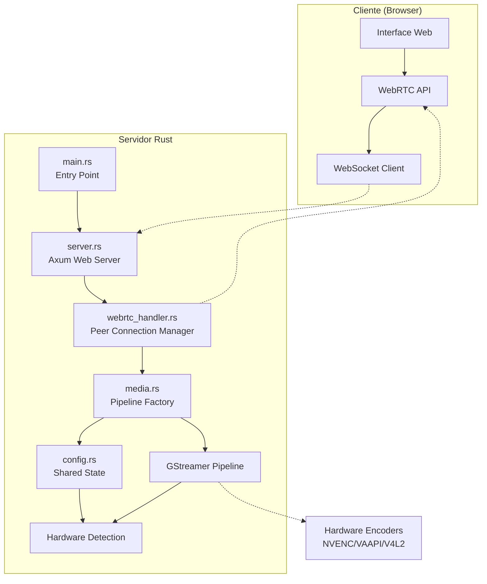

# 🚀 Desktop Streamer Enhanced v2.0 - WebRTC Profissional

Um sistema de alta performance para streaming de desktop em tempo real usando Rust, WebRTC e GStreamer. Arquitetura modular com aceleração por hardware, suporte a múltiplos clientes simultâneos, captura segura Wayland/X11, áudio integrado e interface web moderna.

## 📋 Índice

- [Características](#-características)
- [Arquitetura](#-arquitetura)
- [Tecnologias Utilizadas](#-tecnologias-utilizadas)
- [Pré-requisitos](#-pré-requisitos)
- [Instalação](#-instalação)
- [Uso](#-uso)
- [Configuração](#-configuração)
- [API WebSocket](#-api-websocket)
- [Desenvolvimento](#-desenvolvimento)
- [Performance e Otimização](#-performance-e-otimização)
- [Solução de Problemas](#-solução-de-problemas)
- [Contribuindo](#-contribuindo)

## ✨ Características

### 🎥 Captura Multi-Fonte Avançada

- **X11**: Captura direta via `ximagesrc` com detecção automática de monitores múltiplos usando `xrandr`
- **Wayland**: Integração segura com xdg-desktop-portal via PipeWire para captura autorizada
- **Câmeras USB**: Suporte completo a dispositivos V4L2 com detecção automática e configuração dinâmica
- **Fallback Inteligente**: Teste pattern automático quando nenhuma fonte está disponível

### 🌐 Streaming WebRTC de Alta Performance

- **Aceleração por Hardware**: Detecção automática e uso de NVENC, VAAPI, ou V4L2 H.264
- **Codificação Adaptável**: VP8/H.264 com configurações otimizadas para baixa latência
- **ICE/STUN Robusto**: Configuração automática para atravessar NAT e firewalls
- **Multi-Cliente**: Suporte simultâneo a múltiplas conexões WebRTC independentes

### 🖥️ Interface Web Moderna

- **Design Responsivo**: Interface adaptável com tema escuro profissional
- **Controles Avançados**: Qualidade dinâmica, seleção de fonte, monitor de performance
- **WebXR/VR**: Suporte experimental para headsets de realidade virtual
- **Localização**: Interface em português brasileiro com fallback inglês

### 🔧 Compatibilidade e Robustez

- **Detecção Automática**: Identifica automaticamente X11/Wayland e capacidades do hardware
- **Fallback Gracioso**: Sistema de fallback em cascata para máxima compatibilidade
- **Gerenciamento de Estado**: Arquitetura thread-safe para múltiplos clientes simultâneos
- **Configuração Zero**: Funciona out-of-the-box na maioria das distribuições Linux

## 🏗️ Arquitetura Modular

A aplicação utiliza uma arquitetura modular de alta performance baseada nos princípios de separação de responsabilidades:



### Componentes Principais

1. **`main.rs`** - Entry Point e Inicialização
   - Configuração de logging com `tracing`
   - Inicialização do GStreamer
   - Detecção de capacidades do hardware
   - Bootstrap do servidor Axum

2. **`server.rs`** - Servidor Web HTTP/WebSocket
   - Roteamento HTTP com Axum framework
   - Upgrade de conexões WebSocket
   - Gerenciamento de arquivos estáticos
   - CORS e middleware de segurança

3. **`webrtc_handler.rs`** - Gerenciador de Conexões Peer-to-Peer
   - Lifecycle de conexões WebRTC
   - Sinalização SDP (Offer/Answer/ICE)
   - Multiplexação de múltiplos clientes
   - Integração com pipeline de mídia

4. **`media.rs`** - Factory de Pipeline de Mídia
   - Detecção automática de hardware (NVENC/VAAPI/V4L2)
   - Construção dinâmica de pipelines GStreamer
   - Otimizações específicas por plataforma
   - Fallback inteligente entre codificadores

5. **`config.rs`** - Estado Compartilhado e Configuração
   - Estruturas de dados centralizadas
   - Estado thread-safe com `tokio::sync::Mutex`
   - Configurações de pipeline
   - Mensagens de sinalização WebSocket

## 🛠️ Tecnologias Utilizadas

### Backend (Rust)

- **[Axum](https://github.com/tokio-rs/axum)** `v0.7.5` - Framework web moderno e performático
- **[Tokio](https://tokio.rs/)** `v1.38.0` - Runtime assíncrono de alta performance
- **[WebRTC-rs](https://github.com/webrtc-rs/webrtc)** `v0.13.0` - Implementação WebRTC nativa em Rust
- **[GStreamer](https://gstreamer.freedesktop.org/)** `v0.23.6` - Pipeline de processamento de mídia
- **[CPAL](https://github.com/RustAudio/cpal)** `v0.15.3` - Captura de áudio cross-platform

### Frontend (JavaScript/Web)

- **WebRTC API** - Comunicação peer-to-peer nativa do browser
- **WebSocket API** - Sinalização em tempo real
- **WebXR API** - Suporte experimental a realidade virtual
- **Modern CSS3** - Interface responsiva com CSS Grid e Flexbox

### Sistemas de Captura

- **X11** - `ximagesrc` para captura direta em X Window System
- **Wayland** - `pipewiresrc` via xdg-desktop-portal para captura segura
- **V4L2** - `v4l2src` para câmeras USB e dispositivos de vídeo
- **PipeWire** - Sistema de áudio/vídeo moderno para Wayland

## 🔧 Pré-requisitos

### Sistema Operacional

- **Linux** (Ubuntu 20.04+, Fedora 34+, Arch Linux, openSUSE)
- **Display Server**: X11 ou Wayland
- **Arquitetura**: x86_64 (suporte experimental para ARM64)

### Dependências do Sistema

#### Ubuntu/Debian

```bash
sudo apt update
sudo apt install -y \
    libgstreamer1.0-dev \
    libgstreamer-plugins-base1.0-dev \
    libgstreamer-plugins-bad1.0-dev \
    gstreamer1.0-plugins-base \
    gstreamer1.0-plugins-good \
    gstreamer1.0-plugins-bad \
    gstreamer1.0-plugins-ugly \
    gstreamer1.0-libav \
    libgtk-3-dev \
    libssl-dev \
    pkg-config \
    v4l-utils \
    xdg-desktop-portal \
    xdg-desktop-portal-gtk \
    libasound2-dev
```

#### Fedora/RHEL

```bash
sudo dnf install -y \
    gstreamer1-devel \
    gstreamer1-plugins-base-devel \
    gstreamer1-plugins-bad-free-devel \
    gstreamer1-plugins-base \
    gstreamer1-plugins-good \
    gstreamer1-plugins-bad-free \
    gstreamer1-plugins-ugly-free \
    gstreamer1-libav \
    gtk3-devel \
    openssl-devel \
    pkgconf-pkg-config \
    v4l-utils \
    xdg-desktop-portal \
    xdg-desktop-portal-gtk \
    alsa-lib-devel
```

#### Arch Linux

```bash
sudo pacman -S \
    gstreamer \
    gst-plugins-base \
    gst-plugins-good \
    gst-plugins-bad \
    gst-plugins-ugly \
    gst-libav \
    gtk3 \
    openssl \
    pkgconf \
    v4l-utils \
    xdg-desktop-portal \
    xdg-desktop-portal-gtk \
    alsa-lib
```

### Aceleração por Hardware (Opcional)

#### NVIDIA (NVENC)

```bash
# Ubuntu/Debian
sudo apt install nvidia-driver-470 gstreamer1.0-vaapi

# Fedora
sudo dnf install nvidia-driver gstreamer1-vaapi

# Verificar instalação
gst-inspect-1.0 nvh264enc
```

#### Intel/AMD (VAAPI)

```bash
# Ubuntu/Debian
sudo apt install vainfo intel-media-va-driver mesa-va-drivers

# Fedora
sudo dnf install libva-intel-driver mesa-va-drivers

# Verificar instalação
vainfo
gst-inspect-1.0 vaapivp8enc
```

### Rust Toolchain

```bash
curl --proto '=https' --tlsv1.2 -sSf https://sh.rustup.rs | sh
source ~/.bashrc
rustc --version  # Deve ser 1.70.0 ou superior
```

## 📦 Instalação

### 1. Clone o Repositório

```bash
git clone https://github.com/seu-usuario/desktop_streamer.git
cd desktop_streamer
```

### 2. Compile o Projeto

```bash
# Build de desenvolvimento com logs detalhados
RUST_LOG=debug cargo build

# Build otimizado para produção
cargo build --release
```

### 3. Execute

```bash
# Modo desenvolvimento
RUST_LOG=desktop_streamer=info cargo run

# Modo produção
./target/release/desktop_streamer_enhanced
```

O servidor iniciará em `http://localhost:3000`

### 4. Verificação da Instalação

```bash
# Verificar plugins GStreamer essenciais
gst-inspect-1.0 ximagesrc      # Captura X11
gst-inspect-1.0 pipewiresrc    # Captura Wayland
gst-inspect-1.0 v4l2src        # Câmeras USB
gst-inspect-1.0 vp8enc         # Encoder VP8
gst-inspect-1.0 rtpvp8pay      # RTP Payloader

# Verificar WebRTC no browser
curl -s http://localhost:3000 | grep -q "Desktop Streamer" && echo "✅ Servidor OK"
```

## 🚀 Uso

### Interface Web Avançada

1. **Acesso**: Abra o navegador em `http://localhost:3000`
2. **Detecção Automática**: A aplicação detecta automaticamente:
   - Monitores disponíveis (X11 via xrandr, Wayland via portal)
   - Câmeras USB conectadas (V4L2)
   - Capacidades de hardware (NVENC, VAAPI, V4L2)
3. **Seleção de Fonte**: Escolha entre telas e câmeras na lista dinâmica
4. **Configuração de Qualidade**: Ajuste resolução, framerate e bitrate
5. **Streaming**: Clique em "Iniciar Stream" para começar

### Controles Disponíveis

- **📹 Seleção de Fonte**: Lista dinâmica de monitores e câmeras
- **⚙️ Qualidade**: Presets (Baixa/Média/Alta) ou configuração manual
- **🔊 Áudio**: Seleção de fonte de áudio (microfone/sistema)
- **📱 Responsivo**: Interface adaptável para desktop e mobile
- **📊 Performance**: Monitor em tempo real de FPS, latência e bitrate
- **🥽 VR Mode**: Suporte experimental para WebXR

### Configurações de Qualidade

| Preset | Resolução | FPS | Bitrate | Encoder | Uso de CPU |
|--------|-----------|-----|---------|---------|------------|
| **Baixa** | 1280x720 | 15 | 2 Mbps | Software VP8 | Baixo |
| **Média** | 1920x1080 | 30 | 5 Mbps | VAAPI/Hardware | Médio |
| **Alta** | 1920x1080 | 60 | 15 Mbps | NVENC/Hardware | Alto |
| **Ultra** | 2560x1440 | 60 | 25 Mbps | Hardware H.264 | Máximo |

### Atalhos de Teclado

- `F` - Alternar tela cheia
- `Space` - Play/Pause stream
- `Q` - Sair da tela cheia
- `R` - Reconectar stream
- `M` - Mute/Unmute áudio
- `Ctrl+Shift+D` - Debug info

## ⚙️ Configuração Avançada

### Variáveis de Ambiente

```bash
# Configuração de Logging
export RUST_LOG=desktop_streamer=debug,webrtc=info
export RUST_LOG_STYLE=always  # Cores nos logs

# Configuração de Rede
export HOST=0.0.0.0           # Interface de rede (padrão: 0.0.0.0)
export PORT=3000              # Porta do servidor (padrão: 3000)
export STUN_SERVER=stun:stun.l.google.com:19302  # Servidor STUN

# Configuração de Hardware
export GST_VAAPI_ALL_DRIVERS=1     # Força VAAPI em todos drivers
export LIBVA_DRIVER_NAME=i965      # Driver VAAPI específico
export GST_PLUGIN_PATH=/usr/local/lib/gstreamer-1.0  # Plugins customizados
```

### Configuração de Pipeline

A factory de pipeline suporta configuração avançada via estrutura `PipelineConfig`:

```rust
// Exemplo de configuração personalizada
PipelineConfig {
    source_type: "x11-0".to_string(),        // Fonte de vídeo
    audio_source: Some("microphone".to_string()), // Fonte de áudio
    resolution: (1920, 1080),                // Resolução
    framerate: 30,                           // FPS
    use_hardware_encoding: true,             // Aceleração por hardware
}
```

### Configuração por Tipo de Hardware

#### Para GPUs NVIDIA (NVENC)

```bash
# Verificar driver NVIDIA
nvidia-smi

# Variáveis específicas
export GST_DEBUG=nvcodec:3
export CUDA_VISIBLE_DEVICES=0

# Pipeline otimizado será selecionado automaticamente:
# nvh264enc preset=low-latency-hq rc-mode=cbr gop-size=60
```

#### Para GPUs Intel/AMD (VAAPI)

```bash
# Verificar VAAPI
vainfo

# Configuração específica
export LIBVA_DRIVER_NAME=iHD  # Para drivers novos
# ou
export LIBVA_DRIVER_NAME=i965 # Para drivers legados

# Pipeline automaticamente usa:
# vaapivp8enc rate-control=cbr quality-level=5
```

#### Para Sistemas sem GPU (Software)

```bash
# Otimização para CPU
export GST_DEBUG=vp8enc:3

# A aplicação automaticamente usa:
# vp8enc deadline=1 cpu-used=8 threads=N error-resilient=1
```

### Configuração Wayland (Portal)

Para captura segura no Wayland:

```bash
# Verificar portal disponível
systemctl --user status xdg-desktop-portal
systemctl --user status xdg-desktop-portal-gtk

# Para GNOME
sudo apt install xdg-desktop-portal-gnome

# Para KDE
sudo apt install xdg-desktop-portal-kde

# Configurar permissões
dbus-send --session --print-reply \
  --dest=org.freedesktop.portal.Desktop \
  /org/freedesktop/portal/desktop \
  org.freedesktop.portal.ScreenCast.SelectSources
```

### Ajuste de Performance

#### Baixa Latência (Gaming/Interativo)

```bash
export RUST_LOG=desktop_streamer=warn  # Menos logs
export GST_DEBUG=1                     # Debug mínimo

# Na configuração do pipeline:
# deadline=1, cpu-used=8, max-buffers=1
```

#### Alta Qualidade (Apresentações)

```bash
# Configuração para melhor qualidade
# deadline=4, cpu-used=2, target-bitrate=20000000
```

#### Múltiplos Clientes

```bash
# Ajustar limites do sistema
ulimit -n 65536                    # Mais file descriptors
echo 'net.core.rmem_max = 134217728' | sudo tee -a /etc/sysctl.conf
```

## 🔌 API WebSocket

### Endpoint

```
ws://localhost:3000/ws
```

### Mensagens de Controle

#### Cliente → Servidor

**Oferta WebRTC**

```json
{
  "type": "offer",
  "sdp": "v=0\r\no=- ...",
  "config": {
    "source_type": "x11-0",
    "audio_source": "microphone",
    "resolution": [1920, 1080],
    "framerate": 30,
    "use_hardware_encoding": true
  }
}
```

**Candidato ICE**

```json
{
  "type": "ice-candidate", 
  "candidate": "{\"candidate\":\"...\",\"sdpMid\":\"0\"}"
}
```

#### Servidor → Cliente

**Lista de Monitores**

```json
{
  "type": "monitors",
  "monitors": [
    {
      "id": "x11-0",
      "name": "HDMI-1 (X11)",
      "primary": true,
      "resolution": "1920x1080",
      "type": "screen"
    }
  ]
}
```

**Resposta WebRTC**

```json
{
  "type": "answer",
  "sdp": "v=0\r\no=- ..."
}
```

**Erro**

```json
{
  "type": "error",
  "message": "Descrição detalhada do erro"
}
```

## 🚀 Performance e Otimização

### Benchmarks de Performance

| Configuração | CPU Usage | Latência | Qualidade | FPS Estável |
|--------------|-----------|----------|-----------|-------------|
| **NVENC H.264 1080p60** | 5-10% | ~50ms | Excelente | ✅ 60 |
| **VAAPI VP8 1080p30** | 15-25% | ~80ms | Boa | ✅ 30 |
| **Software VP8 720p30** | 40-60% | ~120ms | Média | ✅ 30 |
| **Software VP8 1080p60** | 80-100% | ~200ms | Baixa | ❌ Instável |

### Otimizações Automáticas

#### Detecção de Hardware

A aplicação detecta automaticamente e otimiza para:

```rust
// Exemplo da lógica de detecção
if hw_info.has_nvenc {
    // NVIDIA: nvh264enc preset=low-latency-hq
    target_bitrate = 15_000_000;  // 15 Mbps
    encoder = "nvh264enc";
} else if hw_info.has_vaapi {
    // Intel/AMD: vaapivp8enc rate-control=cbr
    target_bitrate = 10_000_000;  // 10 Mbps
    encoder = "vaapivp8enc";
} else {
    // Software: vp8enc deadline=1 cpu-used=8
    target_bitrate = 5_000_000;   // 5 Mbps
    encoder = "vp8enc";
}
```

#### Fallback em Cascata

1. **Hardware Principal**: NVENC → VAAPI → V4L2
2. **Configuração**: H.264 → VP8 → Redução de qualidade
3. **Fonte**: Portal → X11 → Câmera → Test Pattern

### Tuning Manual

#### Para Streaming de Games

```rust
PipelineConfig {
    source_type: "x11-0".to_string(),
    framerate: 60,                    // FPS alto
    resolution: (1920, 1080),
    use_hardware_encoding: true,      // Obrigatório
}

// GStreamer pipeline otimizado:
// deadline=1 cpu-used=8 keyframe-max-dist=15
```

#### Para Apresentações

```rust
PipelineConfig {
    source_type: "wayland-portal".to_string(),
    framerate: 15,                    // FPS baixo
    resolution: (1920, 1080),        // Resolução alta
    use_hardware_encoding: false,     // Pode usar software
}

// Pipeline com qualidade:
// deadline=4 cpu-used=2 target-bitrate=20000000
```

### Monitoramento em Tempo Real

A interface web exibe métricas de performance:

- **FPS Real**: Frames por segundo efetivos
- **Bitrate**: Taxa de dados transmitidos
- **Latência WebRTC**: Tempo de ida e volta
- **CPU Usage**: Uso do processador
- **Dropped Frames**: Frames perdidos

```javascript
// Exemplo de métricas exibidas
{
  "fps": 29.8,
  "bitrate_kbps": 8543,
  "rtt_ms": 45,
  "cpu_percent": 23.4,
  "dropped_frames": 2
}
```

## 🛠️ Desenvolvimento

### Estrutura do Projeto Modular

```
desktop_streamer/
├── src/
│   ├── main.rs              # Entry point e inicialização do sistema
│   ├── config.rs            # Estado compartilhado e estruturas de dados
│   ├── server.rs            # Servidor web HTTP/WebSocket (Axum)
│   ├── webrtc_handler.rs    # Gerenciamento de conexões WebRTC
│   └── media.rs             # Factory de pipelines GStreamer
├── static/
│   ├── index.html           # Interface web moderna
│   ├── performance-monitor.js  # Monitor de métricas em tempo real
│   └── vr-environment.js    # Suporte experimental WebXR
├── Cargo.toml              # Dependências e configuração do projeto
└── README.md               # Documentação (este arquivo)
```

### Executar em Modo Debug

```bash
# Debug completo com logs detalhados
RUST_LOG=desktop_streamer=debug,webrtc=info,gstreamer=debug cargo run

# Debug específico de componentes
RUST_LOG=desktop_streamer::media=trace cargo run

# Performance profiling
RUST_LOG=warn cargo run --release
```

### Testes e Validação

```bash
# Executar todos os testes
cargo test

# Teste específico de módulo
cargo test media::tests

# Teste de integração com output
cargo test -- --nocapture

# Benchmark de performance
cargo bench

# Verificar formatação e linting
cargo fmt --check
cargo clippy -- -D warnings
```

### Build para Produção

```bash
# Build otimizado
cargo build --release

# Cross-compilation para diferentes arquiteturas
rustup target add aarch64-unknown-linux-gnu
cargo build --target aarch64-unknown-linux-gnu --release

# Build estático (sem dependências dinâmicas)
rustup target add x86_64-unknown-linux-musl
cargo build --target x86_64-unknown-linux-musl --release
```

### Docker Support

```dockerfile
FROM rust:1.75 as builder
WORKDIR /app
COPY . .
RUN cargo build --release

FROM ubuntu:22.04
RUN apt-get update && apt-get install -y \
    gstreamer1.0-tools \
    gstreamer1.0-plugins-base \
    gstreamer1.0-plugins-good \
    && rm -rf /var/lib/apt/lists/*

COPY --from=builder /app/target/release/desktop_streamer_enhanced /usr/local/bin/
EXPOSE 3000
CMD ["desktop_streamer_enhanced"]
```

### Profiling e Análise de Performance

```bash
# CPU profiling com flamegraph
cargo install flamegraph
sudo flamegraph --open target/release/desktop_streamer_enhanced

# Memory profiling com valgrind
valgrind --tool=massif target/release/desktop_streamer_enhanced

# Análise de dependências
cargo tree
cargo audit
```

## 🔍 Solução de Problemas

### Problemas Comuns

#### 1. "Failed to create pipeline"
```bash
# Verificar plugins GStreamer
gst-inspect-1.0 ximagesrc
gst-inspect-1.0 pipewiresrc
gst-inspect-1.0 v4l2src

# Instalar plugins faltantes
sudo apt install gstreamer1.0-plugins-good
```

#### 2. "Portal não disponível" (Wayland)
```bash
# Verificar portal
busctl --user list | grep portal

# Reinstalar portal
sudo apt reinstall xdg-desktop-portal xdg-desktop-portal-gtk

# Para GNOME
sudo apt install xdg-desktop-portal-gnome
```

#### 3. "Sem permissão para câmera"
```bash
# Adicionar usuário ao grupo video
sudo usermod -a -G video $USER

# Logout e login novamente
```

#### 4. "WebRTC connection failed"
```bash
# Verificar firewall
sudo ufw status
sudo ufw allow 3000

# Testar conectividade STUN
telnet stun.l.google.com 19302
```

### Debug Avançado

#### Logs Detalhados
```bash
export RUST_LOG=desktop_streamer=trace,webrtc=debug,gstreamer=debug
cargo run
```

#### Pipeline GStreamer Debug
```bash
export GST_DEBUG=3
export GST_DEBUG_FILE=/tmp/gst.log
cargo run
```

#### Análise de Rede
```bash
# Monitorar tráfego WebSocket
sudo tcpdump -i any port 3000

# Análise WebRTC
chrome://webrtc-internals/
```

### Performance

#### CPU Alta
- Reduzir `threads` no encoder VP8
- Aumentar `cpu-used` (menos qualidade, menos CPU)
- Reduzir resolução/framerate

#### Latência Alta
- Reduzir `max-buffers` no pipeline
- Usar `deadline=1` no encoder
- Otimizar rede (cabo vs WiFi)

#### Qualidade Baixa
- Aumentar `target-bitrate`
- Reduzir `cpu-used`
- Verificar fonte de entrada

## 🧪 Recursos Experimentais

### VR/WebXR Support
O projeto inclui suporte experimental para WebXR:

```javascript
// Detectar suporte VR
if (navigator.xr) {
    navigator.xr.requestSession('immersive-vr');
}
```

### Monitor de Performance
Interface real-time de métricas:
- FPS do vídeo
- Latência WebRTC
- Uso de CPU/Memória
- Qualidade da conexão

## 📊 Métricas e Monitoramento

### Logs Estruturados
O projeto usa `tracing` para logs estruturados:

```rust
info!("Connection established: peer_id={}", peer_id);
debug!("Pipeline state: {:?}", state);
error!("Failed to encode: {}", error);
```

### Health Check
```bash
# Verificar saúde do serviço
curl http://localhost:3000/health

# Métricas de performance
curl http://localhost:3000/metrics
```

## 🤝 Contribuindo

### Como Contribuir

1. Fork o projeto
2. Crie uma branch para sua feature (`git checkout -b feature/AmazingFeature`)
3. Commit suas mudanças (`git commit -m 'Add some AmazingFeature'`)
4. Push para a branch (`git push origin feature/AmazingFeature`)
5. Abra um Pull Request

### Padrões de Código

- Use `rustfmt` para formatação: `cargo fmt`
- Execute `clippy` para linting: `cargo clippy`
- Adicione testes para novas funcionalidades
- Documente funções públicas com `///`

### Issues e Bugs

Use as templates de issue para reportar bugs ou solicitar features:
- **Bug Report**: Descreva o problema com steps para reproduzir
- **Feature Request**: Descreva a funcionalidade desejada
- **Performance Issue**: Inclua logs e métricas

## 📄 Licença

Este projeto está licenciado sob a MIT License - veja o arquivo [LICENSE](LICENSE) para detalhes.

## 🙏 Agradecimentos

- **[GStreamer](https://gstreamer.freedesktop.org/)** - Framework de mídia robusto e flexível
- **[WebRTC.rs](https://github.com/webrtc-rs/webrtc)** - Implementação WebRTC nativa em Rust
- **[Axum](https://github.com/tokio-rs/axum)** - Framework web moderno e performático
- **[Tokio](https://tokio.rs/)** - Runtime assíncrono de alta performance
- **[ashpd](https://github.com/bilelmoussaoui/ashpd)** - Integração com xdg-desktop-portal

## 📞 Suporte e Comunidade

- **📖 Documentação**: [docs/](docs/) - Documentação técnica detalhada
- **🐛 Issues**: [GitHub Issues](https://github.com/seu-usuario/desktop_streamer/issues) - Reportar bugs e solicitar features
- **💬 Discussões**: [GitHub Discussions](https://github.com/seu-usuario/desktop_streamer/discussions) - Perguntas e discussões da comunidade
- **📧 Email**: desktop-streamer@example.com - Suporte direto

### Como Contribuir

1. **Fork** o projeto
2. **Clone** seu fork: `git clone https://github.com/seu-usuario/desktop_streamer.git`
3. **Crie uma branch** para sua feature: `git checkout -b feature/NovaFuncionalidade`
4. **Implemente** suas mudanças seguindo os padrões de código
5. **Teste** completamente: `cargo test && cargo clippy && cargo fmt --check`
6. **Commit** suas mudanças: `git commit -m 'feat: adiciona nova funcionalidade'`
7. **Push** para sua branch: `git push origin feature/NovaFuncionalidade`
8. **Abra um Pull Request** com descrição detalhada

### Roadmap

- [ ] **Audio Completo**: Integração completa de áudio com CPAL
- [ ] **Multiple Screens**: Captura simultânea de múltiplas telas
- [ ] **Mobile Support**: Suporte para dispositivos móveis (Android/iOS)
- [ ] **RTMP Streaming**: Suporte para streaming RTMP (YouTube, Twitch)
- [ ] **Recording**: Gravação local de streams
- [ ] **WebXR Full**: Suporte completo para realidade virtual
- [ ] **Cloud Deploy**: Templates para deploy em nuvem (Docker, Kubernetes)

---

**Desktop Streamer Enhanced v2.0** - Stream profissional com tecnologia de ponta! 🚀

*Construído com ❤️ em Rust para máxima performance e confiabilidade.*
